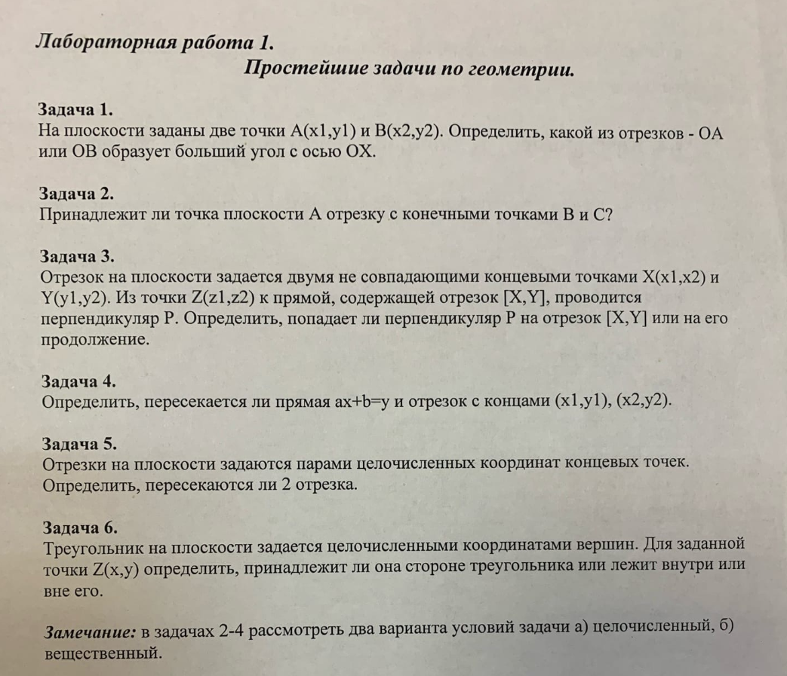
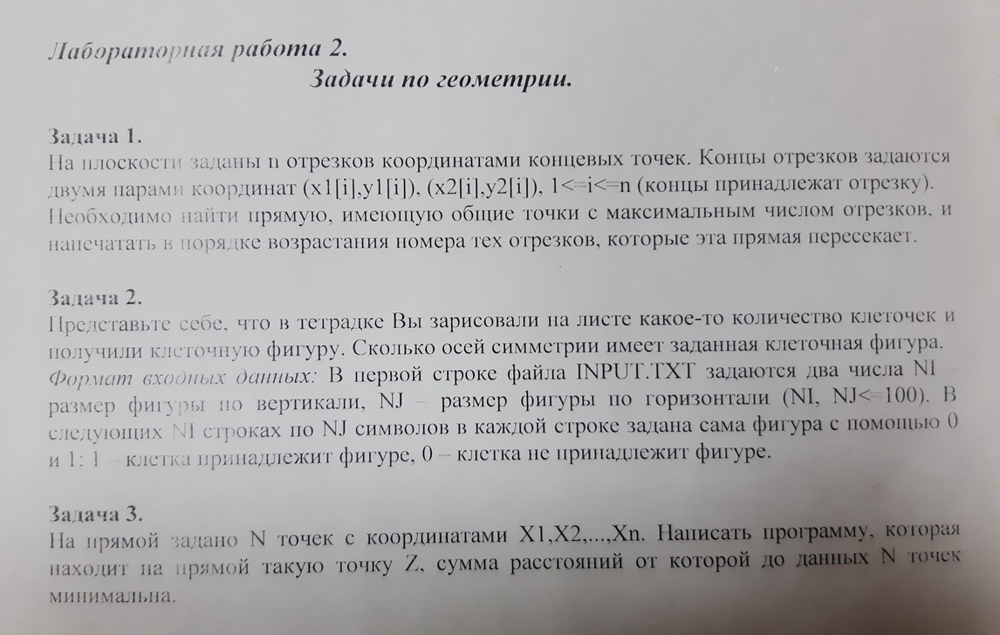
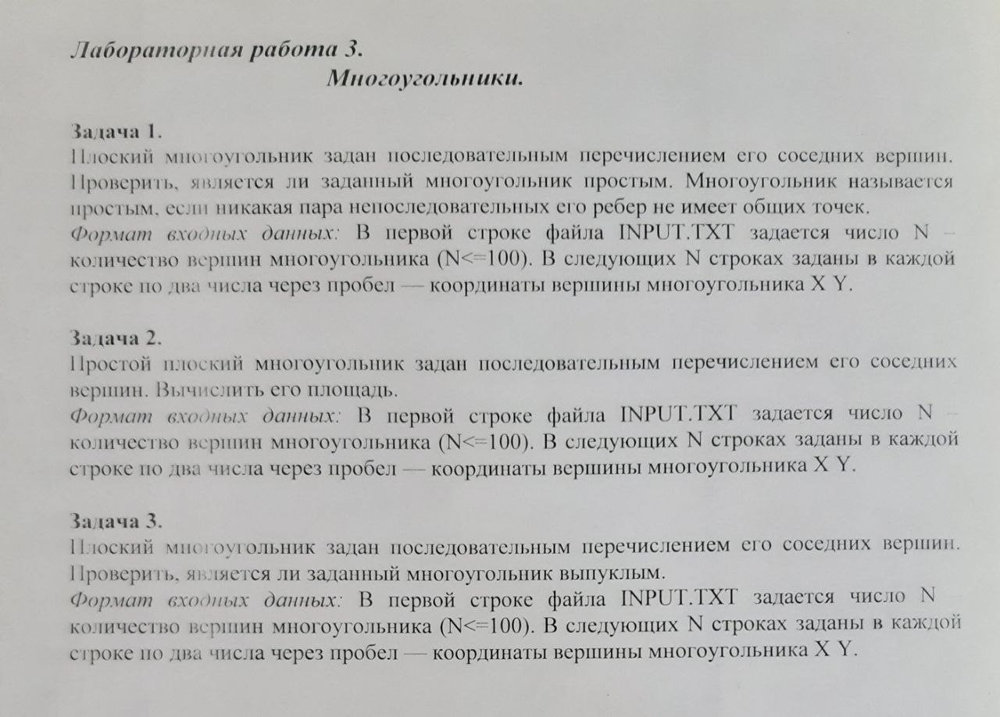
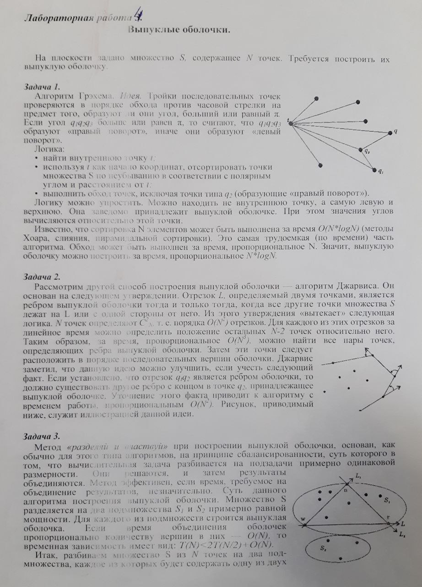

# Вычислительная геометрия

Пока что все одной кучей лежит в **functions.go**, рядом в **functions_test.go** есть тесты.
Есть какие-то вызовы с красивым выводом в консоль в **main.go**.

## Лабораторная №1

## Лабораторная №2

## Лабораторная №3

## Лабораторная №4

